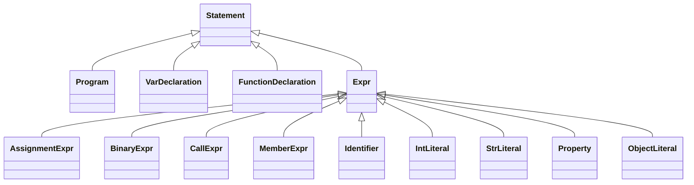

# AST Nodes

```mermaid
classDiagram
  Statement <|-- Program
  Statement <|-- VarDeclaration
  Statement <|-- FunctionDeclaration
  Statement <|-- Expr
  Expr <|-- AssignmentExpr
  Expr <|-- BinaryExpr
  Expr <|-- CallExpr
  Expr <|-- MemberExpr
  Expr <|-- Identifier
  Expr <|-- IntLiteral
  Expr <|-- StrLiteral
  Expr <|-- Property
  Expr <|-- ObjectLiteral
```
