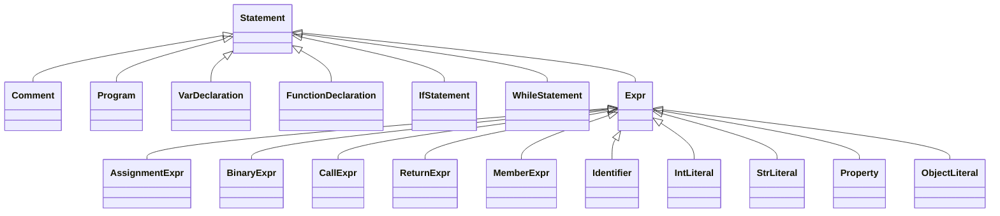
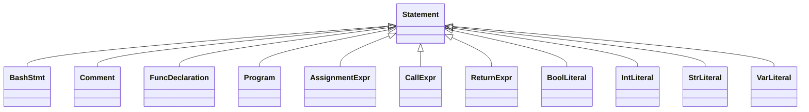

# AST Nodes

**Content**
- [ScriLa AST Nodes](#scrila-ast-nodes)
- [Bash AST Nodes](#bash-ast-nodes)

## ScriLa AST Nodes

```mermaid
classDiagram
  Statement <|-- Comment
  Statement <|-- Program
  Statement <|-- VarDeclaration
  Statement <|-- FunctionDeclaration
  Statement <|-- IfStatement
  Statement <|-- WhileStatement
  Statement <|-- Expr
  Expr <|-- AssignmentExpr
  Expr <|-- BinaryExpr
  Expr <|-- CallExpr
  Expr <|-- ReturnExpr
  Expr <|-- MemberExpr
  Expr <|-- Identifier
  Expr <|-- IntLiteral
  Expr <|-- StrLiteral
  Expr <|-- Property
  Expr <|-- ObjectLiteral
```

## Bash AST Nodes

```mermaid
classDiagram
  Statement <|-- BashStmt
  Statement <|-- Comment
  Statement <|-- FuncDeclaration
  Statement <|-- Program
  Statement <|-- AssignmentExpr
  Statement <|-- CallExpr
  Statement <|-- ReturnExpr
  Statement <|-- BoolLiteral
  Statement <|-- IntLiteral
  Statement <|-- StrLiteral
  Statement <|-- VarLiteral
```
