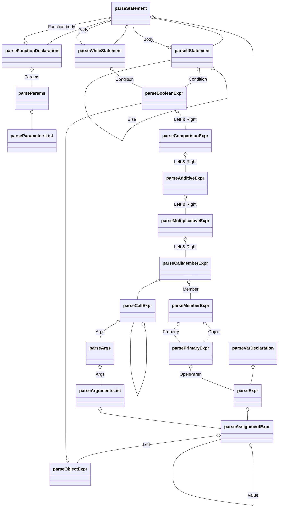

# Parser

## Order of Precedence

```mermaid
classDiagram
  parseStatement o-- parseFunctionDeclaration

  parseStatement o-- parseIfStatement
  parseIfStatement o-- parseBooleanExpr : Condition
  parseIfStatement o-- parseStatement : Body
  parseIfStatement o-- parseIfStatement : Else

  parseStatement o-- parseWhileStatement
  parseWhileStatement o-- parseBooleanExpr : Condition
  parseWhileStatement o-- parseStatement : Body

  parseFunctionDeclaration o-- parseParams : Params
  parseFunctionDeclaration o-- parseStatement : Function body
  parseParams o-- parseParametersList

  parseStatement o-- parseVarDeclaration
  parseVarDeclaration o-- parseExpr
  parseExpr o-- parseAssignmentExpr
  parseAssignmentExpr o-- parseAssignmentExpr : Value
  parseAssignmentExpr o-- parseObjectExpr : Left
  parseObjectExpr o-- parseBooleanExpr
  parseBooleanExpr o-- parseComparisonExpr : Left & Right
  parseComparisonExpr o--parseAdditiveExpr : Left & Right
  parseAdditiveExpr o-- parseMultiplicitaveExpr : Left & Right
  parseMultiplicitaveExpr o-- parseCallMemberExpr : Left & Right

  parseCallMemberExpr o-- parseMemberExpr : Member
  parseMemberExpr o-- parsePrimaryExpr : Object
  parseMemberExpr o-- parsePrimaryExpr : Property
  parsePrimaryExpr o-- parseExpr : OpenParen

  parseCallMemberExpr o-- parseCallExpr
  parseCallExpr o-- parseArgs : Args
  parseCallExpr o-- parseCallExpr
  parseArgs o-- parseArgumentsList : Args
  parseArgumentsList o-- parseAssignmentExpr
  
```
