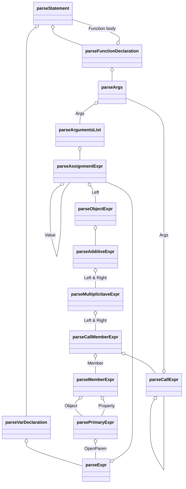

# Parser

## Order of Precedence

```mermaid
classDiagram
  parseStatement o-- parseFunctionDeclaration
  parseFunctionDeclaration o-- parseArgs
  parseFunctionDeclaration o-- parseStatement : Function body

  parseStatement o-- parseVarDeclaration
  parseVarDeclaration o-- parseExpr
  parseExpr o-- parseAssignmentExpr
  parseAssignmentExpr o-- parseAssignmentExpr : Value
  parseAssignmentExpr o-- parseObjectExpr : Left
  parseObjectExpr o-- parseAdditiveExpr
  parseAdditiveExpr o-- parseMultiplicitaveExpr : Left & Right
  parseMultiplicitaveExpr o-- parseCallMemberExpr : Left & Right

  parseCallMemberExpr o-- parseMemberExpr : Member
  parseMemberExpr o-- parsePrimaryExpr : Object
  parseMemberExpr o-- parsePrimaryExpr : Property
  parsePrimaryExpr o-- parseExpr : OpenParen

  parseCallMemberExpr o-- parseCallExpr
  parseCallExpr o-- parseArgs : Args
  parseCallExpr o-- parseCallExpr
  parseArgs o-- parseArgumentsList : Args
  parseArgumentsList o-- parseAssignmentExpr
  
```
