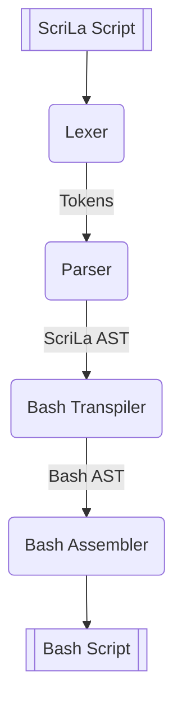

# Steps

**Content**
- [Overview](#overview)
- [1. Lexer](#1-lexer)
- [2. Parser](#2-parser)
- [3. Bash Transpiler](#3-bash-transpiler)
- [4. Bash Assembler](#4-bash-assembler)

## Overview

## 1. Lexer
The lexer traverses every single character from the source file.
Each token contains a token type (e.g. if, comment, identifier, semicolon) and the string.

## 2. Parser
The parser traverses the array of tokens and creates an AST.
The syntax checks are mostly done here, for example if the token after the token `if` is a open parenthesis `(`.

The deeper an entry is in the tree, the higher is its priority.

## 3. Bash Transpiler
The Bash transpiler traverses the (ScriLa) AST, checks if the left and right hand side of a assignment are the same types (and other checks), and creates an AST for Bash.

This step is required because Bash has a different syntax than ScriLa:  
For example getting the result of a function call. Bash can only return a status code via the `return` keyword. The transpiler uses a temporary variable as return value. That means that after a function call an assignment from the temporary variable to the user given variable is required.

## 4. Bash Assembler
The bash assembler traverses the (Bash) AST and generates each statement into Bash code. Because each statement is a statement supported in Bash the creation of Bash source code has less complexity.

The separation of concerns makes each step simpler. The transpiler "just" needs to create the correct order of the Bash statements. The assembler contains the logic to create valid Bash source code.